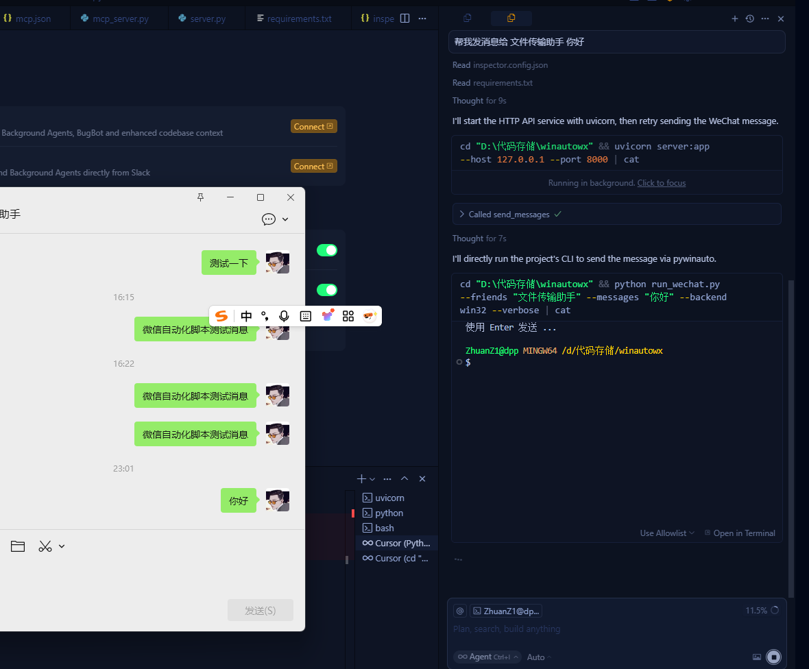

# WinAutoWx 针对 Weixin/WeChat 自动化脚本 支持 LLM 的 MCP 

本项目提供一个基于 Python + pywinauto 的自动化脚本，可在 Windows 上连接/启动微信（Weixin/WeChat），搜索好友或群聊并发送消息，支持一次性向多个好友循环发送多条消息。





## 启动指令速查
- 命令行（CLI 用法已迁移至 Debug 文档）
请参考 `Debug.md` 获取 `run_wechat.py` 的命令行用法与调试说明。

- 启动 HTTP API 服务（FastAPI）
```bash
uvicorn server:app --host 127.0.0.1 --port 8000
```

- 启动 fastmcp（MCP/stdio）服务并用 MCP Inspector 连接
```bash
python mcp_server.py
mcp-inspector --server "python mcp_server.py"
```

## 环境要求
- Windows 10/11（64 位推荐）
- Python 3.8–3.12（64 位推荐）
- 已安装并登录 Windows 版微信（Weixin/WeChat）

## 安装
```bash
pip install -r requirements.txt
```

## 快速上手
若需要通过命令行快速发送或调试，请查看 `Debug.md`。以下为通过 HTTP API/MCP 的方式：

## 参数说明（CLI）
命令行参数表已迁移至 `Debug.md`。

## 常见用法示例（CLI）
命令行示例已迁移至 `Debug.md`。

## 通过 API 调用（FastAPI / fastmcp 2.0）
已提供 `server.py`，可作为本地服务供 AI/HTTP 调用。

- 启动服务：
```bash
uvicorn server:app --host 127.0.0.1 --port 8000
```

- 发送消息接口：POST `http://127.0.0.1:8000/send`
```json
{
  "friends": ["文件传输助手"],
  "messages": ["测试一下"],
  "backend": "win32",
  "ctrl_enter": false,
  "friend_delay": 0.5,
  "message_delay": 0.2,
  "no_launch": false,
  "verbose": true
}
```

- 导出控件接口：POST `http://127.0.0.1:8000/dump`
```json
{
  "backend": "win32",
  "verbose": true
}
```

说明：脚本主体位于 `script/wechat_sender.py`。命令行使用说明见 `Debug.md`；HTTP 接口由 `server.py` 提供。

### 通过 fastmcp（MCP/stdio 协议）

已提供 `mcp_server.py`（基于 `fastmcp` 2.0）。它是一个 MCP 服务器，通过标准输入输出（stdio）对外暴露工具。内部会把工具调用转发到上面的 HTTP 服务。

1) 安装依赖并启动 HTTP 服务：
```bash
pip install -r requirements.txt
uvicorn server:app --host 127.0.0.1 --port 8000
```

2) 启动 MCP 服务器（stdio）：
```bash
python mcp_server.py
```

3) -用 MCP Inspector 连接：-（废弃）
```bash
mcp-inspector --server "python mcp_server.py"
```

工具说明：
- `send_messages(friends, messages, backend='uia'|'win32', ctrl_enter=False, friend_delay=0.5, message_delay=0.2, no_launch=False, verbose=False)`
- `dump_controls(backend='uia'|'win32', verbose=True)`

可用环境变量：
- `WEIXIN_API_URL`：转发的 HTTP 服务地址（默认 `http://127.0.0.1:8000`）

### MCP Inspector 配置
1) 先启动 HTTP 服务（新终端）：
```bash
uvicorn server:app --host 127.0.0.1 --port 8000
```
npx @modelcontextprotocol/inspector


2) 在 MCP Inspector 中填写：
- **Server command**:
```bash
python mcp_server.py
```
- **Working Directory**:
```bash
D:\代码存储\winautowx
```
- **Environment variables**（可选）：
  - `WEIXIN_API_URL`: `http://127.0.0.1:8000`
- **Arguments**: 留空
- **Transport**: 默认 stdio（保持不变）
- 点击 Connect

3) 在 Inspector 中调用 tools：
- `send_messages` 示例参数：
```json
{
  "friends": ["文件传输助手"],
  "messages": ["测试一下"],
  "backend": "win32",
  "ctrl_enter": false,
  "friend_delay": 0.5,
  "message_delay": 0.2,
  "no_launch": false,
  "verbose": true
}
```
- `dump_controls` 示例参数：
```json
{
  "backend": "win32",
  "verbose": true
}
```

## 使用建议
- 保持微信主窗口处于当前桌面且未最小化。
- 先用“文件传输助手”验证流程，避免打扰他人。
- 若你的微信版本为新版 Weixin（进程 `Weixin.exe`），脚本已适配。
- 特殊布局或企业微信可能与控件结构不同，遇到问题请开 `--verbose` 并将输出粘贴给我。

## 免责声明
- 此脚本仅用于学习与个人效率用途。请遵守相关平台使用条款，避免滥用自动化操作。
